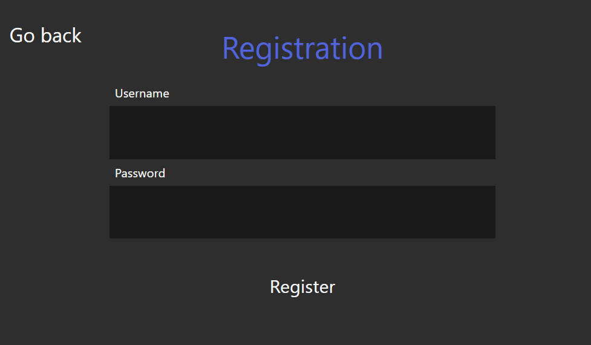
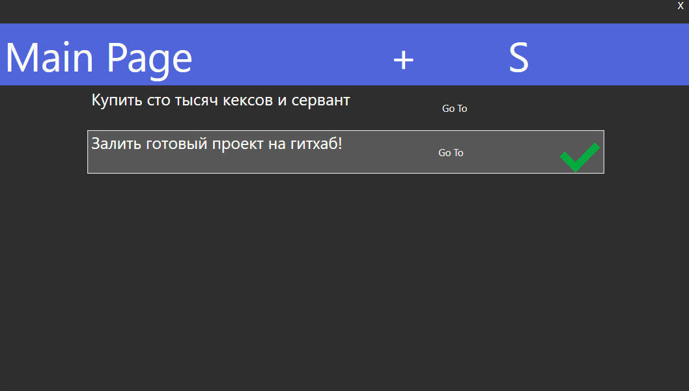
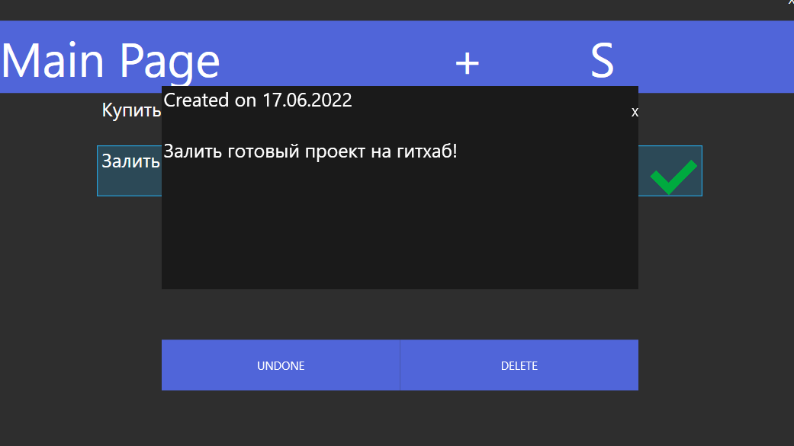
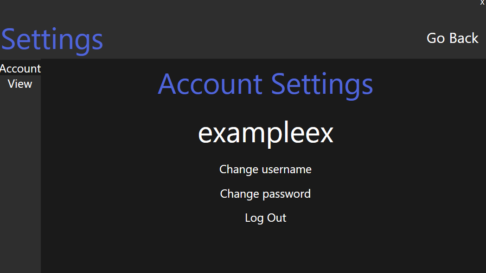
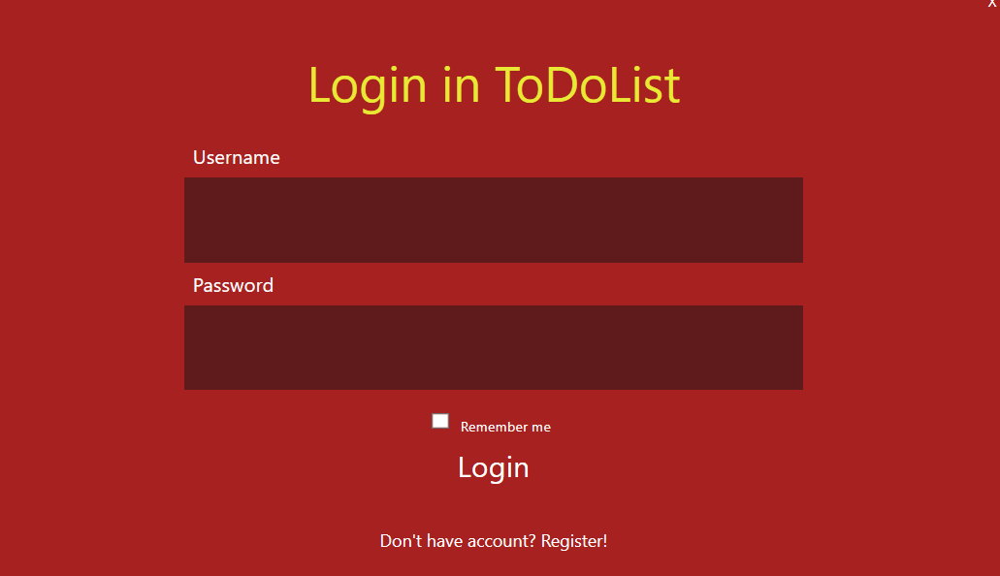

# WpfToDoList
Study ToDoList project on C#.
________________________________________________________________________
Was made to learn :
* MVVM pattern and data bindings in WPF
* WPF
* Some sort of MySQL
_________________________________________________________________________
Application features:
* Comfortable login and register forms

* Main page including such things as adding new ToDos and checking existing ToDos

* Settings such as changing username and password, log out

* Dark and light theme. Also user can create his own themes using custom theme preset

